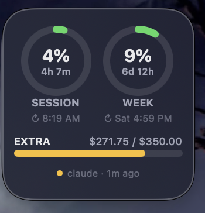
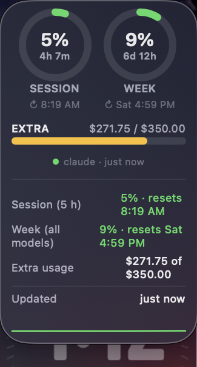

# Claude Usage — macOS Desktop Widget

A small floating desktop **widget** for macOS that shows your live **Claude Code**
plan usage: the **5-hour session** limit and the **weekly** limit, each with a
reset countdown, plus extra-usage credits. It's the same size and shape as a
built-in macOS desktop widget, so it sits neatly next to them.

It reads the exact same numbers as Claude Code's own `/usage` screen, and
refreshes every 60 seconds.

<table align="center">
  <tr>
    <td align="center"><b>Compact</b></td>
    <td align="center"><b>Expanded</b> — click anywhere to toggle</td>
  </tr>
  <tr>
    <td valign="top"></td>
    <td valign="top"></td>
  </tr>
</table>

<p align="center"><sub><i>5-hour session &amp; weekly rings with reset countdowns and an extra-usage credits bar. Click to expand for per-model weekly usage, absolute reset times, and a session-usage sparkline.</i></sub></p>

---

## ⚠️ Placement — read this first

> **Drop this widget directly on top of one of your existing official macOS
> desktop widgets.** macOS keeps your desktop icons clear of the region occupied
> by its own built-in widgets, so by overlaying a system widget you guarantee
> that **your desktop icons never get hidden underneath this floating panel.**

This widget deliberately uses the exact footprint of a macOS *small* desktop
widget (180×180 pt) so it lines up on the same grid. If you place it over empty
desktop space instead, any file icons that happen to sit under it will be
covered and become hard to click — so park it on top of a real system widget
(Clock, Weather, Calendar, etc.). To add a system widget to your desktop, click
the date/time in the menu bar → **Edit Widgets**, drag one to the desktop, then
launch Claude Usage and drag it on top.

---

## How it gets your usage (and what it does *not* do)

- **Endpoint:** `GET https://api.anthropic.com/api/oauth/usage` — the same
  endpoint Claude Code's `/usage` screen calls. The response has `five_hour`,
  `seven_day`, `seven_day_opus`, `seven_day_sonnet` buckets (each
  `{utilization, resets_at}`) and an `extra_usage` block.
- **Token:** it reads your existing **Claude Code** OAuth token from the login
  Keychain item `Claude Code-credentials` by shelling out to `/usr/bin/security`
  once per poll. Claude Code rotates that token itself; re-reading each poll
  picks up rotations automatically.
- **No credentials are stored or transmitted anywhere** except in the
  `Authorization: Bearer` header to `api.anthropic.com`. Nothing is written to
  disk by this app except its saved window position. There are no secrets in this
  repository.
- If you're not signed into Claude Code, or the token has expired, the widget
  shows `Sign-in expired — use Claude Code once to refresh` and keeps displaying
  the last good numbers. (There's no refresh-token flow; just run Claude Code
  once to refresh.)

> This is an **unofficial** community widget. It is not affiliated with or
> endorsed by Anthropic. It only reads your own account's usage using your own
> local Claude Code login.

## Behavior

- Two **rings** — SESSION (5 h) and WEEK — showing % used, a live countdown to
  reset in the middle, and the absolute reset time underneath.
- An **EXTRA** bar for extra-usage credits (shown only if enabled on your plan).
- A status footer: green/amber dot + "last updated N s ago."
- **Click** → expand a detail view (per-model weekly usage for Opus / Sonnet,
  absolute reset times, extra usage, and a session-usage sparkline).
- **Drag** anywhere to reposition. Position is remembered between launches.
- **Right-click** → Expand/Collapse, *Refresh Now*, *Launch at Login* toggle, Quit.
- Polls every 60 s; the countdowns tick every second.

Color coding: green < 70 % used, amber 70–90 %, red > 90 %.

## Build & run

```sh
./build.sh        # produces "Claude Usage.app" (ad-hoc signed, no Xcode project)
open "Claude Usage.app"
```

Requires the Xcode Command Line Tools (`swiftc`) and macOS 13 (Ventura) or newer.
You also need **Claude Code** installed and signed in on the same Mac, since the
widget reuses its Keychain login.

Because the app is only **ad-hoc signed** (no paid Developer ID), the first time
you open it macOS Gatekeeper may say it "cannot be opened." Right-click the app →
**Open**, or run `xattr -dr com.apple.quarantine "Claude Usage.app"`, to allow it.

The **first time** it reads the Keychain item, macOS may prompt to allow access —
click *Always Allow* so it can poll without prompting again.

### Auto-start

On first launch it installs a per-user LaunchAgent at
`~/Library/LaunchAgents/com.claudeusagewidget.mac.plist` (`RunAtLoad`), so it
returns after a reboot and restores its last position. Toggle via right-click →
**Launch at Login**. If you move the app, toggle it off and on again to refresh
the stored path.

## Customizing

- **Bundle identifier / LaunchAgent label** — `com.claudeusagewidget.mac`. Change
  it in `build.sh` (`CFBundleIdentifier`) and in `Sources/ClaudeUsage.swift`
  (`agentLabel`) if you want your own.
- **Size / corners** — tune `windowSize`, `panelMargin`, `panelRadius` at the top
  of `WidgetView`.
- **Thresholds / colors** — the `warn` / `crit` values in `LimitRing` /
  `BarMetric`, resolved by `Threshold.color`.
- **Poll rate** — the `60` s timer interval in `Usage.init`.

## Files

```
claude-usage-widget/
├── build.sh                 swiftc build (single file, ad-hoc signed)
├── Sources/
│   └── ClaudeUsage.swift    the whole app (usage model + SwiftUI + window glue)
├── AGENT_CONTEXT.md         orientation for AI coding agents (read this to modify it)
├── LICENSE                  MIT
└── README.md
```

## For AI agents

If you're an AI coding assistant asked to open or modify this project, start with
[`AGENT_CONTEXT.md`](AGENT_CONTEXT.md) — it maps out the architecture, the usage
API shape, the Keychain token read, and the known SourceKit false positives.

## License

MIT — see [LICENSE](LICENSE). Do whatever you like with it; no warranty. Not
affiliated with Anthropic.
